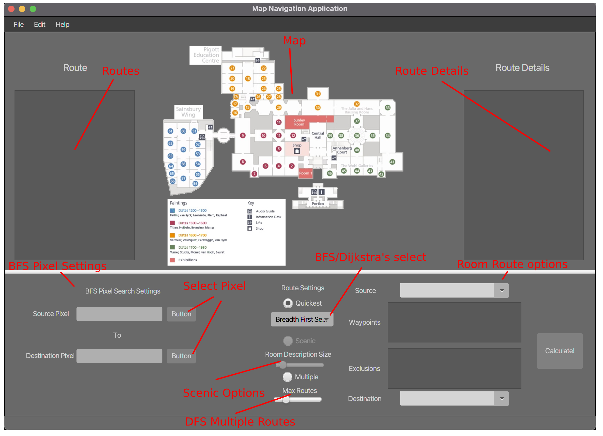

# Museum Map Route Finder

## Description

This program is a CA for Data Structures and Alogrithms 2 in WIT. It is a program that uses various algorithms to find the shortest path between two or rooms in a museum. The program reads in a file that contains the museum layout and then uses the algorithms to find the shortest path between two rooms. 

## Features

- Dijkstra's Algorithm to find the shortest path between two rooms, this can be selected in the UI by selecting the Dijkstra's Algorithm select box.
- Breadth First Search to find the shortest path between two rooms, this can be selected in the UI by selecting the Breadth First Search select box.
- Depth First Search to find the multiple paths between two rooms, this can be selected in the UI by selecting the Multiple Paths radio button.

## Notes

- To select a pixel on the map, select the button to the right of the text field, then click on the map to select the pixel. The start and end point cannot be too far apart, the algorithm will stack overflow if the distance is too far.
- Anything beside BFS will use the room selection panel on the right, BFS is the only algorithm that uses the pixel selection.
- This code also uses CoolNodes and CoolLinkedLists, these are custom list data structures created previously in the course.

## Annotated GUI

## Credits

Group project by:
- Cian Farrell
- Conor Gleeson

**Note to current 2nd years:** *Please do not plagiarise this code, its not very good and you will probably get caught.*